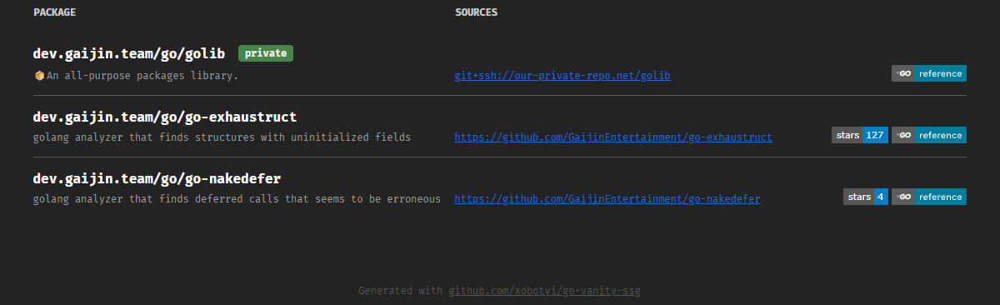

# go-vanity-ssg

CLI tool allowing generation static-site pages generation enabling support for
golang's [vanity imports](https://pkg.go.dev/cmd/go#hdr-Remote_import_paths).

Main features of this implementation:

- **Emit index page with list of all packages**  
  Allows to showcase all packages that are supported by vanity import source.
- **Static pages**  
  No need in any sort of webserver - you can provide vanity imports even being hosted from GitHub pages. For example,
  this package distributed using vanity imports, pages are [hosted on GitHub](https://github.com/xobotyi/go).
- **Versioned packages support**  
  Generate separate pages for major package versions (e.g., `package/v2.html`, `package/v3.html`) to support Go module versioning.
- **Public/private packages split.**  
  In cases when you need to enable clients from local networks to be redirected to local repositories and documentation,
  this tool allows emitting static assets for such cases. With a little bit of webserver tweaking you will be able to
  serve different content depending on clint source.
- **Customizable templates**  
  Tool allows to load own templates, for the case you want to swag a bit.



## Installation

```shell
go install xobotyi.github.io/go/go-vanity-ssg@latest
```

## Usage

### `go-vanity-ssg emit-config`

Emits example config file.

**_Flags:_**

- **`--config`** - path to config file. Default: `./.vanity.config.yaml`
- **`--overwrite`** - overwrite config file if it already exists.

### `go-vanity-ssg emit-templates`

Emits template files embedded into tool.

**_Flags:_**

- **`--dir`** - path to directory to emit templates to. Default: `./templates`
- **`--overwrite`** - overwrite template files if exists.

### `go-vanity-ssg`

Emit generated html files.

**_Flags:_**

- **`--config`** - path to config file to use. Default: `./.vanity.config.yaml`
- **`--out-dir`** - Directory to emit html files. Default: `./dist`
- **`--templates-dir`** - Directory to load custom templates from.
- **`--public`** - Emit public packages files (default).
- **`--private`** - Emit private packages files.
- **`--no-inherit-public`** - Do not include public packages to the list of private packages.
-

## Configuration

To generate the pages, the tool requires a configuration file to be present.
The config file must be in `YAML` format. The default location is [./.vanity.config.yaml](./.vanity.config.yaml), but it
can be changed using the `--config` flag.

### Configuration Options

- **`out-dir`**: Specifies the output directory for the generated HTML files. Default is `./dist`.
- **`vanity-root`**: The root URL for vanity imports. For example, `dev.gaijin.team/go`.
- **`packages`**: A list of packages to be included in the vanity import site. Each package can have the following
  fields:
    - **`name`**: The name of the package.
    - **`description`**: A brief description of the package.
    - **`versions`**: (Optional) A list of major version numbers to generate versioned package pages for (e.g., `[2, 3]` creates `package/v2.html` and `package/v3.html`).
    - **`source`**: Information about the public source repository.
        - **`vcs-type`**: The version control system type (e.g., `git`).
        - **`vcs-uri`**: The URI of the version control system.
        - **`uri`**: The URI of the repository.
        - **`dir-uri`**: The URI template for directories in the repository.
        - **`file-uri`**: The URI template for files in the repository.
        - **`swag`**: A list of additional badges or images to include.
    - **`private-source`**: same as `source`, but for private package source, this configuration used during generation
      with `--private` flag.

### Versioned Packages

When you specify `versions` in a package configuration, the tool will generate additional HTML files for each major version. For example:

```yaml
packages:
  - name: "my-package"
    description: "Example package"
    versions: [2, 3, 4]
    source:
      # ... source configuration
```

This will generate:
- `my-package.html` - Base package page
- `my-package/v2.html` - Version 2 page  
- `my-package/v3.html` - Version 3 page
- `my-package/v4.html` - Version 4 page

The index page will only show the base package (without version suffixes) to keep it clean and organized.

An example configuration file can be found in the [`.vanity.config.yaml`](./.vanity.config.yaml) file.